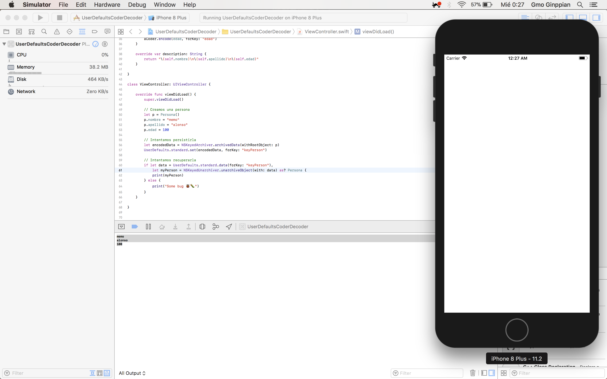

UserDefaults Guardar Objetos con el Protocolo NSCoder
===

<p align="center">
	
</p>

## Descripción

Podemos guardar variables de diferentes tipos de datos primitivos como: Enteros, Flotantes, Strings, Bools pero si queremos guardar todo un objeto de una clase o incluso un arraeglo de objetos tendriamos que convertir el objeto a un binario (NSData) y después guardarlo en un archivo, el problema de esto para la *Clase* es saber cono serealizar las variables, como solución a esto Apple nos presentar el protocolo *NSCoding* que contiene dos métodos: 

```swift
	public func encode(with aCoder: NSCoder)

	public init?(coder aDecoder: NSCoder) // NS_DESIGNATED_INITIALIZER
```

1. **encode** que le indica a la clase como va a codificar o guardar con una key

2. **decode** que le indica a la clase como va a deserealizar esas variables, en que las va a castear y a donde las va a asignar

3. el protocolo nos deja una nota *NS_DESIGNATED_INITIALIZER* es decir, necesitamos implementar un inicializador designado, que en este caso sólo sobre escribimos el inicializador y llamamos a los inicializadores superiores

## Código

```swift
//
//  ViewController.swift
//  UserDefaultsCoderDecoder
//
//  Created by Gmo Ginppian on 02/01/18.
//  Copyright © 2018 BUAP. All rights reserved.
//

import UIKit

class Persona: NSObject, NSCoding {
    
    var nombre: String = String()
    var apellido: String = String()
    var edad: Int = Int()
    
    // Inicializamos herencia 
    override init() {
         super.init()
    }
    
    // Decoder
    //required init(coder decoder: NSCoder) {}
    required init(coder aDecoder: NSCoder) {
        self.nombre = aDecoder.decodeObject(forKey: "nombre") as? String ?? ""
        self.apellido = aDecoder.decodeObject(forKey: "apellido") as? String ?? ""
        //list for > swift 3 and for < swift 3 you can user decodeObject, font: developer.apple.com/reference/foundation/nscoder, for both:
        self.edad = aDecoder.decodeObject(forKey: "edad") as? Int ??  aDecoder.decodeInteger(forKey: "edad")
    }
    
    // Encode
    func encode(with aCoder: NSCoder) {
        aCoder.encode(nombre, forKey: "nombre")
        aCoder.encode(apellido, forKey: "apellido")
        aCoder.encode(edad, forKey: "edad")
    }
    
    // Sobreescribimos description el metodo llamado cuando imprimimos una variable
    override var description: String {
        return "\(self.nombre)\n\(self.apellido)\n\(self.edad)"
    }

}

class ViewController: UIViewController {

    override func viewDidLoad() {
        super.viewDidLoad()
    
        // Creamos una persona
        let p = Persona()
        p.nombre = "memo"
        p.apellido = "alonso"
        p.edad = 100
        
        // Intentamos persistirla
        let encodedData = NSKeyedArchiver.archivedData(withRootObject: p)
        UserDefaults.standard.set(encodedData, forKey: "keyPerson")
        
        // Intentamos recuperarla
        if let data = UserDefaults.standard.data(forKey: "keyPerson"),
            let myPerson = NSKeyedUnarchiver.unarchiveObject(with: data) as? Persona {
            print(myPerson)
        } else {
            print("Some bug 🐞🐛")
        }
    }

}
```

## Fuente

* <a href="https://stackoverflow.com/questions/37980432/swift-3-saving-and-retrieving-custom-object-from-userdefaults">StackOverFlow</a>

* <a href="https://developer.apple.com/documentation/foundation/nscoder">List Apple NSCoder</a>

* <a href="https://www.kodigoswift.com/tutorial-swift-inicializadores-designados-y-de-conveniencia/">Inicializadores designados y de conveniencia</a>
